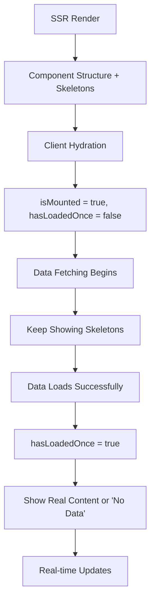

# Smart Hydration Strategy for Connected Components

## 🎯 Overview

Our hydration strategy ensures that connected components render immediately on the server, hydrate smoothly on the client, and provide excellent user experience with zero layout shifts or loading flashes.

## 🏗️ The Problem We're Solving

Traditional approaches to data-aware components often result in:

- **Flash of Empty State**: Components show nothing, then suddenly populate
- **Container Skeletons**: Entire component areas are replaced with loading states
- **Hydration Mismatches**: Server and client render different content
- **Layout Shifts**: Content jumps around as data loads
- **Poor UX**: Users see broken or incomplete interfaces

## ✨ Our Solution: Structure-First Hydration

### Core Principles

1. **Immediate Structure**: Component visual structure renders instantly
2. **Progressive Enhancement**: Data areas show contextual loading states
3. **Zero Layout Shift**: No component boundaries change during loading
4. **Contextual Loading**: Skeletons match the exact shape of expected content
5. **Definitive Loading**: Show skeletons until we KNOW the real data state

### The Flow



### The Critical Insight: hasLoadedOnce Pattern

The key to preventing the "flash of no data" is tracking whether we've ever successfully loaded data:

```typescript
// ❌ WRONG: Shows "No Data" during the gap between mount and data load
const showSkeleton = !isMounted || query.isLoading;

// ✅ CORRECT: Shows skeleton until we definitively know the data state
const [hasLoadedOnce, setHasLoadedOnce] = useState(false);

useEffect(() => {
  if (query.isSuccess && !hasLoadedOnce) {
    setHasLoadedOnce(true);
  }
}, [query.isSuccess, hasLoadedOnce]);

const showSkeleton = !hasLoadedOnce || query.isLoading || query.isFetching;
```

This prevents the race condition where:
1. Component mounts (`isMounted` = true)
2. Query hasn't started yet (`isLoading` = false)
3. Component shows "No Data" (wrong!)
4. Query starts and loads
5. Component shows real data

With `hasLoadedOnce`, we maintain skeletons through the entire initial load cycle.

## 🔧 Implementation Details

### 1. Hydration Detection Hook

```typescript
// lib/utils/hydration.ts
export function useIsHydrated(): boolean {
  const [isHydrated, setIsHydrated] = useState(false);

  useEffect(() => {
    setIsHydrated(true);
  }, []);

  return isHydrated;
}
```

### 2. Progressive Loading Hook

```typescript
export function useProgressiveLoading(enabled: boolean = true) {
  const [isMounted, setIsMounted] = useState(false);
  const [isReady, setIsReady] = useState(false);

  useEffect(() => {
    setIsMounted(true);
    // Small delay to ensure DOM is ready
    const timer = setTimeout(() => setIsReady(true), 0);
    return () => clearTimeout(timer);
  }, []);

  return {
    isMounted,
    isReady: isReady && enabled,
    shouldFetch: isMounted && enabled
  };
}
```

### 3. Data Hook Pattern - The Complete Solution

```typescript
// lib/hooks/connected/use-example-data.ts
export function useExampleData(id?: string) {
  const [isMounted, setIsMounted] = useState(false);
  const [hasLoadedOnce, setHasLoadedOnce] = useState(false);

  useEffect(() => {
    setIsMounted(true);
  }, []);

  const query = useQuery({
    queryKey: ['example', id],
    queryFn: fetchExample,
    enabled: isMounted, // 🔑 KEY: Only fetch after mount
    staleTime: 5 * 60 * 1000,
    refetchOnWindowFocus: false,
    placeholderData: { // 🔑 KEY: Provide structure
      value: 0,
      title: '',
      trend: 'neutral'
    }
  });

  // 🔑 KEY: Track when we've successfully loaded data at least once
  useEffect(() => {
    if (query.isSuccess && !hasLoadedOnce) {
      setHasLoadedOnce(true);
    }
  }, [query.isSuccess, hasLoadedOnce]);

  return {
    ...query,
    // 🔑 KEY: Show skeleton until we have a definitive answer
    showSkeleton: !hasLoadedOnce || query.isLoading || query.isFetching,
    isInitialLoad: !isMounted,
    hasLoadedOnce
  };
}
```

### 4. Component Implementation

```typescript
// components/premium/connected/example-live.tsx
export const ExampleLive = ({ title, ...props }) => {
  const { data, showSkeleton, error } = useExampleData(props.id);

  // 🔑 KEY: Component structure always renders
  return (
    <Card className="p-4">
      <CardHeader>
        <CardTitle>{title}</CardTitle>
      </CardHeader>
      <CardContent>
        {/* 🔑 KEY: Internal skeleton, not container skeleton */}
        <div className="text-2xl font-bold">
          {showSkeleton ? (
            <SkeletonPremium className="h-8 w-24" />
          ) : error ? (
            'Error'
          ) : (
            data.value
          )}
        </div>
        
        <div className="text-sm text-muted-foreground mt-2">
          {showSkeleton ? (
            <SkeletonPremium className="h-4 w-16" />
          ) : (
            data.subtitle
          )}
        </div>
      </CardContent>
    </Card>
  );
};
```

## 📊 Comparison: Our Approach vs Traditional

### ❌ Traditional Approach

```typescript
// Poor UX - shows nothing then everything
function BadExample() {
  const { data, isLoading } = useQuery({
    queryKey: ['data'],
    queryFn: fetchData,
    enabled: true // Fetches on server and client
  });

  if (isLoading) {
    return <SkeletonCard />; // Entire component is skeleton
  }

  return <DataCard data={data} />;
}
```

**Problems:**
- Flash of empty state during SSR
- Hydration mismatch warnings
- Entire component replaces during loading
- Layout shift when data loads

### ✅ Our Approach

```typescript
// Excellent UX - structure first, progressive enhancement
function GoodExample() {
  const [isMounted, setIsMounted] = useState(false);
  
  useEffect(() => setIsMounted(true), []);

  const { data, isLoading } = useQuery({
    queryKey: ['data'],
    queryFn: fetchData,
    enabled: isMounted, // Only fetch on client
    placeholderData: { value: 0 }
  });

  const showSkeleton = !isMounted || (isLoading && !data);

  return (
    <Card> {/* Structure always present */}
      <CardContent>
        <div className="text-2xl">
          {showSkeleton ? <Skeleton /> : data.value}
        </div>
      </CardContent>
    </Card>
  );
}
```

**Benefits:**
- No hydration mismatches
- Structure visible immediately
- Smooth loading transitions
- Zero layout shift

## 🎨 Skeleton Strategies

### 1. Content-Aware Skeletons

Match skeleton shape to expected content:

```typescript
// For metrics
<SkeletonPremium className="h-8 w-24" /> // Number placeholder

// For text
<SkeletonPremium className="h-4 w-32" /> // Text placeholder

// For lists
<SkeletonList items={3} showAvatar />
```

### 2. Contextual Skeletons

Use different skeletons based on content type:

```typescript
function MetricDisplay({ type, showSkeleton, data }) {
  if (showSkeleton) {
    switch (type) {
      case 'currency':
        return <SkeletonPremium className="h-8 w-20" />; // $1,234
      case 'percentage':
        return <SkeletonPremium className="h-6 w-16" />; // 12.3%
      case 'count':
        return <SkeletonPremium className="h-8 w-12" />; // 42
    }
  }
  
  return <span>{data.value}</span>;
}
```

### 3. Animated Skeletons

Use our premium skeleton animations:

```typescript
<SkeletonPremium 
  animation="pulse" // or "shimmer", "wave"
  className="h-4 w-full"
/>
```

## 🔄 Real-time Updates Integration

### Smooth Transitions

Real-time updates should flow seamlessly through the hydration system:

```typescript
function useExampleWithRealtime(id: string) {
  const queryClient = useQueryClient();
  const [isMounted, setIsMounted] = useState(false);

  // Standard data fetching
  const query = useQuery({
    queryKey: ['example', id],
    queryFn: fetchExample,
    enabled: isMounted
  });

  // Real-time updates
  useEffect(() => {
    if (!isMounted) return;

    const channel = supabase.channel(`example-${id}`);
    
    channel.on('postgres_changes', { 
      event: 'UPDATE', 
      schema: 'public', 
      table: 'examples',
      filter: `id=eq.${id}`
    }, (payload) => {
      // Update cache directly - no loading states
      queryClient.setQueryData(['example', id], payload.new);
    });

    channel.subscribe();
    return () => supabase.removeChannel(channel);
  }, [isMounted, id, queryClient]);

  return query;
}
```

## 🧪 Testing Hydration

### Unit Tests

Test hydration behavior:

```typescript
describe('ExampleLive Hydration', () => {
  it('shows skeleton initially', () => {
    const { container } = render(<ExampleLive id="123" />);
    
    // Should show skeleton elements
    expect(container.querySelector('[data-testid="skeleton"]')).toBeInTheDocument();
  });

  it('loads data after mount', async () => {
    global.fetch = jest.fn().mockResolvedValue({
      ok: true,
      json: () => Promise.resolve({ value: 'test' })
    });

    render(<ExampleLive id="123" />);
    
    await waitFor(() => {
      expect(screen.getByText('test')).toBeInTheDocument();
    });
  });
});
```

### Integration Tests

Test with real SSR/hydration:

```typescript
// Using Next.js testing utilities
import { render } from '@testing-library/react';
import { renderToString } from 'react-dom/server';

describe('SSR Hydration', () => {
  it('matches server and client render', () => {
    const Component = () => <ExampleLive id="123" />;
    
    // Server render
    const serverHtml = renderToString(<Component />);
    
    // Client render (initial)
    const { container } = render(<Component />);
    const clientHtml = container.innerHTML;
    
    // Should match (no hydration warnings)
    expect(serverHtml).toBe(clientHtml);
  });
});
```

## 📱 Mobile Considerations

### Performance on Slow Connections

```typescript
function useMobileOptimizations() {
  const [connectionType, setConnectionType] = useState('fast');

  useEffect(() => {
    // Detect connection speed
    const connection = (navigator as any).connection;
    if (connection) {
      setConnectionType(connection.effectiveType);
    }
  }, []);

  return {
    // Longer stale times for slow connections
    staleTime: connectionType === '2g' ? 10 * 60 * 1000 : 5 * 60 * 1000,
    // Shorter grace periods for fast connections
    gracePeriod: connectionType === '4g' ? 50 : 200
  };
}
```

### Touch Interactions

Ensure loading states don't interfere with touch:

```typescript
<Card className={cn(
  "transition-all duration-200",
  showSkeleton && "pointer-events-none" // Disable interactions during loading
)}>
  {/* Content */}
</Card>
```

## 🔍 Debugging Hydration Issues

### Common Problems

1. **Hydration Mismatch Warnings**
   ```typescript
   // Problem: Server and client render differently
   const [count, setCount] = useState(Math.random());
   
   // Solution: Consistent initial state
   const [count, setCount] = useState(0);
   ```

2. **Flash of Unstyled Content**
   ```typescript
   // Problem: CSS not loaded
   // Solution: Ensure critical CSS is inlined
   ```

3. **Skeleton Flashing**
   ```typescript
   // Problem: Skeleton shows then immediately hides
   const showSkeleton = !isMounted || (isLoading && !data);
   
   // Solution: Add minimum display time
   const showSkeleton = useSmoothedLoading(isLoading, !!data, isMounted);
   ```

### Debug Tools

```typescript
// Add debug information in development
function useHydrationDebug(componentName: string) {
  useEffect(() => {
    if (process.env.NODE_ENV === 'development') {
      console.log(`${componentName} hydrated at:`, Date.now());
    }
  }, []);
}
```

## 📋 Checklist for New Connected Components

- [ ] Uses `useState(false)` for `isMounted`
- [ ] Uses `useState(false)` for `hasLoadedOnce`
- [ ] Sets `isMounted = true` in `useEffect`
- [ ] Tracks `hasLoadedOnce` when query succeeds
- [ ] Only enables queries when `isMounted` is `true`
- [ ] Shows skeleton until `hasLoadedOnce` is true
- [ ] Provides `placeholderData` for structure
- [ ] Uses internal skeletons, never container skeletons
- [ ] Handles error states gracefully
- [ ] Updates cache directly for real-time (no `invalidateQueries`)
- [ ] Tests both SSR and client-side behavior
- [ ] Matches expected content shape with skeletons
- [ ] No hydration mismatch warnings in dev tools
- [ ] No flash of "No Data" between skeleton and real data

## 🎯 Performance Metrics

### What to Measure

- **Time to First Contentful Paint (FCP)**: Should be immediate (structure renders)
- **Time to Interactive (TTI)**: Should be fast (no blocking during hydration)
- **Cumulative Layout Shift (CLS)**: Should be 0 (no layout shifts)
- **First Input Delay (FID)**: Should be minimal (no blocking JavaScript)

### Monitoring

```typescript
// Add performance monitoring
function usePerformanceMonitoring(componentName: string) {
  useEffect(() => {
    const startTime = performance.now();
    
    return () => {
      const endTime = performance.now();
      console.log(`${componentName} hydration took:`, endTime - startTime, 'ms');
    };
  }, []);
}
```

---

This hydration strategy ensures that our connected components provide the best possible user experience while maintaining real-time functionality and excellent performance across all devices and connection speeds.