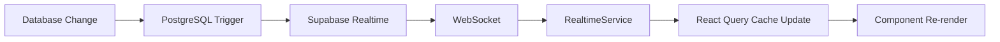
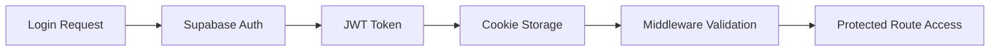

# 🏗️ The Phone Guys CRM - Complete Architecture Documentation

> **Last Updated**: January 2025  
> **Version**: 1.0.0  
> **Status**: Production Ready (99% Complete)

## Table of Contents

1. [System Overview](#system-overview)
2. [Technology Stack](#technology-stack)
3. [Architecture Patterns](#architecture-patterns)
4. [Data Flow Architecture](#data-flow-architecture)
5. [Directory Structure](#directory-structure)
6. [Core Components](#core-components)
7. [Real-time Architecture](#real-time-architecture)
8. [Security Architecture](#security-architecture)
9. [Performance Optimizations](#performance-optimizations)
10. [Deployment Architecture](#deployment-architecture)

---

## System Overview

The Phone Guys CRM is a comprehensive repair management system built with modern web technologies, designed for scalability, real-time collaboration, and exceptional user experience. The system manages the complete lifecycle of mobile device repairs, from customer intake through service completion.

### Key Characteristics

- **Real-time Collaborative**: Multiple users can work simultaneously with instant updates
- **Repository Pattern**: Clean separation of data access and business logic
- **Service Layer Architecture**: Business logic encapsulated in reusable services
- **Type-Safe**: Full TypeScript implementation with strict typing
- **Performance Optimized**: Lazy loading, code splitting, and optimistic updates
- **Security First**: Row Level Security, authentication, and authorization at every layer

## Technology Stack

### Frontend Technologies

| Technology | Version | Purpose |
|------------|---------|---------|
| **Next.js** | 15.1.4 | React framework with App Router |
| **React** | 19.0.0 | UI component library |
| **TypeScript** | 5.x | Type safety and developer experience |
| **Tailwind CSS** | 3.4.17 | Utility-first CSS framework |
| **shadcn/ui** | Latest | Component library (New York style) |
| **TanStack Query** | 5.x | Server state management |
| **Recharts** | 2.15.0 | Data visualization |
| **React Hook Form** | 7.x | Form state management |
| **Zod** | 3.x | Schema validation |

### Backend Technologies

| Technology | Version | Purpose |
|------------|---------|---------|
| **Supabase** | 2.48.1 | Backend as a Service |
| **PostgreSQL** | 15.x | Primary database |
| **Supabase Auth** | Latest | Authentication service |
| **Supabase Realtime** | Latest | WebSocket subscriptions |
| **Supabase Storage** | Latest | File storage service |
| **Row Level Security** | - | Database-level security |

### Development Tools

| Tool | Purpose |
|------|---------|
| **Turbopack** | Fast development builds |
| **ESLint** | Code quality enforcement |
| **Prettier** | Code formatting |
| **Supabase CLI** | Local development & migrations |
| **Docker** | Containerized services |

## Architecture Patterns

### 1. Repository Pattern

The repository pattern abstracts database operations, providing a clean interface for data access.

```typescript
// Base Repository
export abstract class BaseRepository<T> {
  protected supabase: SupabaseClient;
  protected table: string;

  async findById(id: string): Promise<T | null>
  async findAll(): Promise<T[]>
  async create(data: Partial<T>): Promise<T>
  async update(id: string, data: Partial<T>): Promise<T>
  async delete(id: string): Promise<boolean>
}

// Specific Implementation
export class RepairTicketRepository extends BaseRepository<RepairTicket> {
  constructor(useServiceRole = false) {
    super('repair_tickets', useServiceRole);
  }

  async findWithCustomer(id: string) {
    return this.supabase
      .from(this.table)
      .select('*, customers(*)')
      .eq('id', id)
      .single();
  }
}
```

### 2. Service Layer Pattern

Services encapsulate business logic and orchestrate repository operations.

```typescript
export class RepairOrderService {
  constructor(
    private ticketRepo: RepairTicketRepository,
    private customerRepo: CustomerRepository,
    private noteRepo: TicketNoteRepository
  ) {}

  async createOrder(data: CreateOrderDTO): Promise<Order> {
    // Business logic validation
    this.validateOrderData(data);
    
    // Orchestrate multiple repository operations
    const customer = await this.ensureCustomer(data.customer);
    const ticket = await this.ticketRepo.create({
      ...data.ticket,
      customer_id: customer.id
    });
    
    // Handle side effects
    if (data.initialNote) {
      await this.noteRepo.create({
        ticket_id: ticket.id,
        content: data.initialNote
      });
    }
    
    return this.transformToOrder(ticket);
  }
}
```

### 3. React Query Integration

TanStack Query manages server state with caching, synchronization, and real-time updates.

```typescript
export function useTickets(filters?: TicketFilters) {
  const queryClient = useQueryClient();
  
  const query = useQuery({
    queryKey: ['tickets', filters],
    queryFn: () => fetchTickets(filters),
    staleTime: 5 * 60 * 1000, // 5 minutes
    refetchOnWindowFocus: false
  });

  // Real-time subscription
  useRealtime({
    channel: 'tickets',
    table: 'repair_tickets',
    onInsert: (payload) => {
      queryClient.setQueryData(['tickets'], old => 
        [...(old || []), payload.new]
      );
    },
    onUpdate: (payload) => {
      queryClient.setQueryData(['tickets'], old =>
        old?.map(t => t.id === payload.new.id ? payload.new : t)
      );
    }
  });

  return query;
}
```

### 4. Optimistic Updates Pattern

Immediate UI feedback with rollback on error.

```typescript
const mutation = useMutation({
  mutationFn: updateTicketStatus,
  onMutate: async (newStatus) => {
    // Cancel in-flight queries
    await queryClient.cancelQueries(['ticket', id]);
    
    // Snapshot for rollback
    const previous = queryClient.getQueryData(['ticket', id]);
    
    // Optimistically update
    queryClient.setQueryData(['ticket', id], old => ({
      ...old,
      status: newStatus
    }));
    
    return { previous };
  },
  onError: (err, newStatus, context) => {
    // Rollback on error
    if (context?.previous) {
      queryClient.setQueryData(['ticket', id], context.previous);
    }
    toast.error('Failed to update status');
  }
});
```

## Data Flow Architecture

### Request Flow

```mermaid
graph LR
    A[User Action] --> B[React Component]
    B --> C[Custom Hook]
    C --> D[API Route/Server Action]
    D --> E[Service Layer]
    E --> F[Repository]
    F --> G[Database]
    G --> H[Response]
    H --> I[Transform]
    I --> J[React Query Cache]
    J --> K[Component Re-render]
```



### Real-time Update Flow



### Authentication Flow



## Directory Structure

```
phoneguys-crm/
├── app/                          # Next.js App Router
│   ├── (dashboard)/             # Protected dashboard routes
│   │   ├── page.tsx            # Dashboard home
│   │   ├── orders/             # Order management
│   │   ├── customers/          # Customer management
│   │   ├── appointments/       # Appointment system
│   │   └── profile/            # User profile
│   ├── admin/                   # Admin-only routes
│   │   ├── users/              # User management
│   │   ├── devices/            # Device catalog
│   │   ├── services/           # Service catalog
│   │   └── media/              # Media gallery
│   ├── api/                     # REST API endpoints
│   │   ├── orders/             # Order endpoints
│   │   ├── customers/          # Customer endpoints
│   │   ├── appointments/       # Appointment endpoints
│   │   └── admin/              # Admin endpoints
│   └── auth/                    # Authentication pages
│       ├── login/              # Login page
│       ├── signup/             # Registration
│       └── reset-password/     # Password reset
│
├── components/                   # React components
│   ├── admin/                   # Admin-specific components
│   ├── appointments/            # Appointment components
│   ├── customers/               # Customer components
│   ├── layout/                  # Layout components
│   ├── orders/                  # Order components
│   ├── premium/                 # Premium UI components
│   │   ├── ui/                 # Base UI components
│   │   └── connected/          # Data-connected components
│   └── ui/                      # shadcn/ui primitives
│
├── lib/                         # Core application logic
│   ├── hooks/                   # React Query hooks
│   │   ├── connected/          # Connected component hooks
│   │   ├── use-tickets.ts      # Ticket management
│   │   ├── use-customers.ts    # Customer management
│   │   └── use-realtime.ts     # Real-time subscriptions
│   ├── repositories/            # Data access layer
│   │   ├── base.repository.ts  # Base repository class
│   │   ├── repair-ticket.repository.ts
│   │   ├── customer.repository.ts
│   │   └── repository-manager.ts # Singleton manager
│   ├── services/                # Business logic layer
│   │   ├── repair-order.service.ts
│   │   ├── customer.service.ts
│   │   ├── realtime.service.ts # Real-time management
│   │   └── timer.service.ts    # Global timer state
│   ├── transformers/            # Data transformation
│   │   ├── ticket.transformer.ts
│   │   └── customer.transformer.ts
│   ├── types/                   # TypeScript definitions
│   │   ├── database.types.ts   # Supabase types
│   │   └── index.ts            # Application types
│   ├── utils/                   # Utility functions
│   │   ├── hydration.ts        # SSR/hydration helpers
│   │   └── connected-component-helpers.ts
│   ├── validations/             # Zod schemas
│   │   ├── forms.ts
│   │   └── repair-order.schema.ts
│   └── supabase/                # Supabase clients
│       ├── client.ts           # Browser client
│       ├── server.ts           # Server client
│       └── service.ts          # Service role client
│
├── supabase/                    # Database configuration
│   ├── migrations/             # SQL migrations
│   ├── seed.sql               # Seed data
│   └── config.toml            # Supabase config
│
└── docs/                        # Documentation
    ├── ARCHITECTURE_COMPLETE.md # This document
    ├── CLAUDE.md               # AI assistance guide
    └── features/               # Feature documentation
```

## Core Components

### 1. Repository Layer

**Purpose**: Abstract database operations and provide a consistent interface for data access.

**Key Repositories**:
- `RepairTicketRepository`: Manages repair ticket operations
- `CustomerRepository`: Handles customer data
- `AppointmentRepository`: Appointment scheduling
- `UserRepository`: User management
- `DeviceRepository`: Device catalog
- `ServiceRepository`: Service catalog

**Repository Manager**: Singleton pattern for repository instances
```typescript
export class RepositoryManager {
  private static instances = new Map();
  
  static get<T>(RepoClass: new() => T, useServiceRole = false): T {
    const key = `${RepoClass.name}-${useServiceRole}`;
    if (!this.instances.has(key)) {
      this.instances.set(key, new RepoClass(useServiceRole));
    }
    return this.instances.get(key);
  }
}
```

### 2. Service Layer

**Purpose**: Encapsulate business logic and orchestrate repository operations.

**Key Services**:
- `RepairOrderService`: Order lifecycle management
- `CustomerService`: Customer operations and history
- `AppointmentService`: Appointment booking and conversion
- `NotificationService`: Email and notification handling
- `TimerService`: Global timer state management
- `RealtimeService`: WebSocket subscription management
- `AuthorizationService`: Role-based access control

### 3. Hook Layer

**Purpose**: Manage data fetching, caching, and real-time updates using React Query.

**Key Hooks**:
- `useTickets()`: Ticket management with real-time updates
- `useCustomers()`: Customer data and devices
- `useAppointments()`: Appointment scheduling
- `useRealtime()`: Generic real-time subscription helper
- `useDashboard()`: Dashboard metrics and statistics

### 4. Component Architecture

**Component Categories**:

1. **Page Components** (`app/`): Next.js pages with server-side rendering
2. **Layout Components** (`components/layout/`): Navigation, headers, sidebars
3. **Feature Components** (`components/[feature]/`): Feature-specific UI
4. **Premium UI Components** (`components/premium/ui/`): Reusable UI elements
5. **Connected Components** (`components/premium/connected/`): Data-aware components

**Component Patterns**:
- Server Components for initial render
- Client Components for interactivity
- Hydration-aware components for SSR
- Optimistic UI updates
- Skeleton loading states

## Real-time Architecture

### WebSocket Management

The real-time system uses Supabase Realtime for WebSocket connections, managed through a centralized service.

```typescript
export class RealtimeService {
  private static instance: RealtimeService;
  private channels: Map<string, RealtimeChannel> = new Map();
  private queryClient: QueryClient;

  static getInstance(queryClient: QueryClient): RealtimeService {
    if (!this.instance) {
      this.instance = new RealtimeService(queryClient);
    }
    return this.instance;
  }

  subscribeToTable(
    table: string,
    callback: (payload: any) => void
  ) {
    const channel = this.supabase
      .channel(`table-${table}`)
      .on('postgres_changes', { 
        event: '*', 
        schema: 'public', 
        table 
      }, callback)
      .subscribe();
      
    this.channels.set(table, channel);
  }
}
```

### Cache Update Strategy

**Principles**:
1. **Never use `invalidateQueries`** in real-time handlers
2. **Always use `setQueryData`** for direct cache updates
3. **Never use `router.refresh()`** - causes full page reload
4. **Implement optimistic updates** with rollback on error

### Real-time Subscription Flow

1. Component mounts and initiates data fetch
2. `useRealtime` hook establishes WebSocket subscription
3. Database changes trigger PostgreSQL events
4. Supabase Realtime broadcasts changes
5. RealtimeService receives and processes updates
6. React Query cache updated directly
7. Components re-render with new data

## Security Architecture

### Authentication Layers

1. **Supabase Auth**: JWT-based authentication
2. **Cookie Management**: Secure, httpOnly cookies
3. **Middleware Protection**: Route-level access control
4. **API Authentication**: API key for external, cookie for internal

### Authorization System

```typescript
export class AuthorizationService {
  private static permissions = {
    admin: ['*'], // Full access
    manager: [
      'orders:read', 'orders:write',
      'customers:read', 'customers:write',
      'reports:read', 'users:read'
    ],
    technician: [
      'orders:read', 'orders:write:own',
      'customers:read', 'timer:manage:own'
    ]
  };

  static can(user: User, permission: string): boolean {
    const userPermissions = this.permissions[user.role];
    return userPermissions.includes('*') || 
           userPermissions.includes(permission);
  }
}
```

### Row Level Security (RLS)

Database-level security policies ensure data isolation:

```sql
-- Users can only see their own data
CREATE POLICY "Users can view own tickets"
  ON repair_tickets FOR SELECT
  USING (technician_id = auth.uid());

-- Admins can see everything
CREATE POLICY "Admins full access"
  ON repair_tickets FOR ALL
  USING (
    EXISTS (
      SELECT 1 FROM users 
      WHERE id = auth.uid() 
      AND role = 'admin'
    )
  );
```

## Performance Optimizations

### 1. Query Optimization

- **Relationship Loading**: Single query with joins instead of N+1
- **Selective Fields**: Only fetch required columns
- **Pagination**: Limit results with cursor-based pagination
- **Indexes**: Strategic database indexes on frequently queried columns

### 2. Caching Strategy

- **Stale Time**: 5 minutes for dashboard data
- **Cache Time**: 30 minutes for reference data
- **Optimistic Updates**: Immediate UI feedback
- **Background Refetch**: Silent data synchronization

### 3. Bundle Optimization

- **Code Splitting**: Dynamic imports for routes
- **Tree Shaking**: Remove unused code
- **Lazy Loading**: Components loaded on demand
- **Image Optimization**: Next.js Image component with lazy loading

### 4. Rendering Optimization

- **Server Components**: Initial HTML from server
- **Streaming SSR**: Progressive rendering
- **Suspense Boundaries**: Granular loading states
- **Memoization**: Prevent unnecessary re-renders

## Deployment Architecture

### Environment Configuration

```bash
# Development
NEXT_PUBLIC_SUPABASE_URL=http://127.0.0.1:54321
NEXT_PUBLIC_SUPABASE_ANON_KEY=local-anon-key

# Production
NEXT_PUBLIC_SUPABASE_URL=https://[project].supabase.co
NEXT_PUBLIC_SUPABASE_ANON_KEY=production-anon-key
```

### Deployment Stack

- **Hosting**: Vercel (Next.js optimized)
- **Database**: Supabase (managed PostgreSQL)
- **Storage**: Supabase Storage (S3 compatible)
- **CDN**: Vercel Edge Network
- **Monitoring**: Vercel Analytics

### CI/CD Pipeline

1. **Development**: Local Supabase, hot reload with Turbopack
2. **Staging**: Preview deployments on Vercel
3. **Production**: Automatic deployment on main branch
4. **Database Migrations**: Supabase CLI with version control

### Scaling Considerations

- **Horizontal Scaling**: Serverless functions auto-scale
- **Database Pooling**: PgBouncer for connection management
- **Caching Layer**: React Query for client, Redis for server (future)
- **CDN Distribution**: Static assets served from edge
- **Real-time Limits**: WebSocket connection pooling

---

## Key Architectural Decisions

### 1. Repository Pattern over Direct Supabase Calls
**Rationale**: Centralized data access, easier testing, consistent error handling

### 2. Service Layer for Business Logic
**Rationale**: Separation of concerns, reusable logic, easier maintenance

### 3. React Query for State Management
**Rationale**: Built-in caching, optimistic updates, real-time integration

### 4. Server Components by Default
**Rationale**: Better SEO, faster initial load, reduced JavaScript bundle

### 5. Supabase as Backend
**Rationale**: Rapid development, built-in auth, real-time capabilities, managed infrastructure

### 6. TypeScript Throughout
**Rationale**: Type safety, better IDE support, reduced runtime errors

### 7. Tailwind CSS + shadcn/ui
**Rationale**: Consistent design system, rapid UI development, accessibility built-in

---

## Future Architecture Considerations

1. **Microservices Migration**: Consider splitting into services as complexity grows
2. **Event-Driven Architecture**: Implement event sourcing for audit trails
3. **GraphQL Layer**: Consider for complex data requirements
4. **Redis Caching**: Add server-side caching layer
5. **Message Queue**: Implement for async processing
6. **Monitoring & Observability**: Add APM and distributed tracing
7. **Multi-tenancy**: Support for multiple repair shops

---

*This document represents the complete architecture of The Phone Guys CRM system as of January 2025. It should be updated as architectural decisions evolve.*